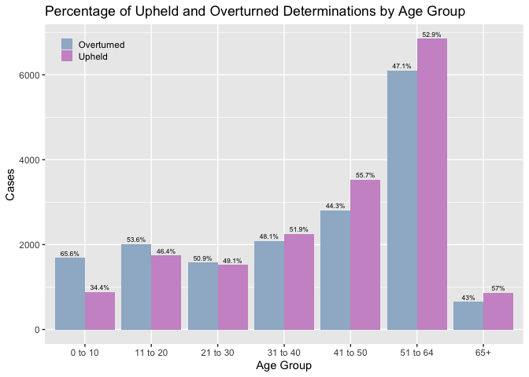
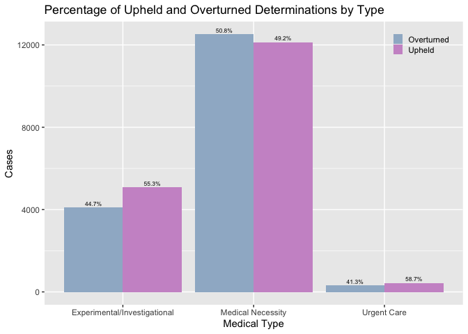
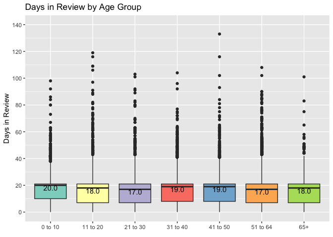
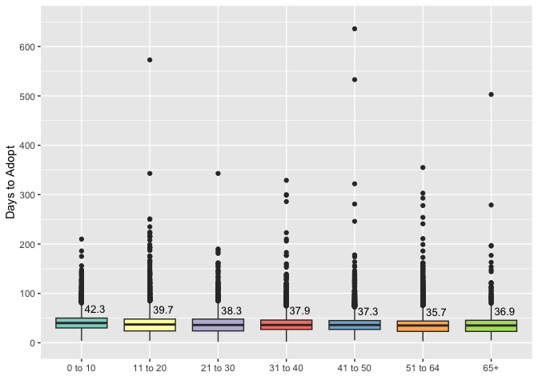
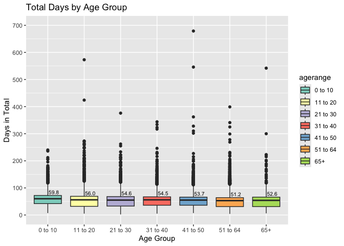
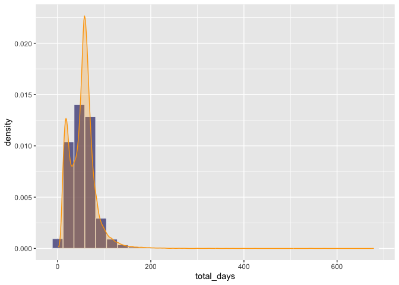
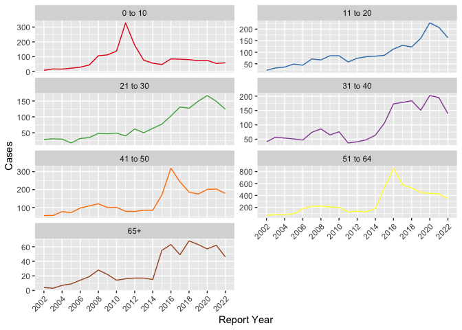
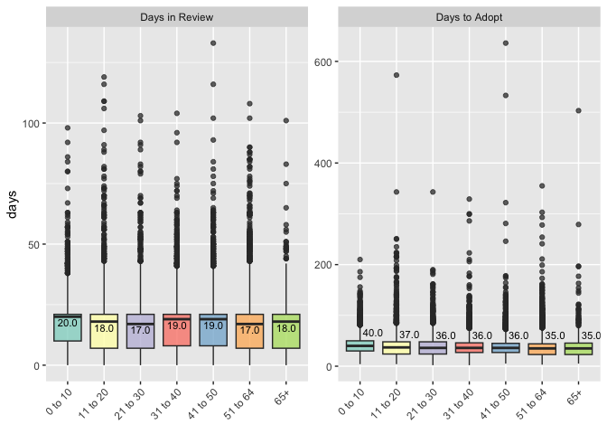
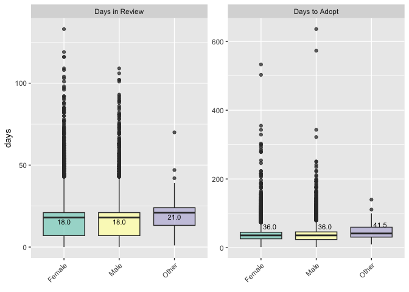

IMR R Analysis
================
Ryan Summers
2024-02-12

``` r
imr_og <- read_csv('imr_cleaned_NEW.csv')
```

``` r
str(imr_og)
```

    ## spc_tbl_ [34,615 × 16] (S3: spec_tbl_df/tbl_df/tbl/data.frame)
    ##  $ ...1                : num [1:34615] 0 1 2 3 4 5 6 7 8 9 ...
    ##  $ ReferenceID         : chr [1:34615] "MN23-38694" "MN23-38692" "MN23-38690" "MN23-38687" ...
    ##  $ ReportYear          : num [1:34615] 2023 2023 2023 2023 2023 ...
    ##  $ DiagnosisCategory   : chr [1:34615] "Endocrine/Metabolic" "Skin Disorders" "Infectious Disease" "Autism Spectrum" ...
    ##  $ DiagnosisSubCategory: chr [1:34615] "Diabetes" "Psoriasis" "COVID 19" "Autistic Disorder" ...
    ##  $ TreatmentCategory   : chr [1:34615] "Pharmacy" "Pharmacy" "Diag/ MD Eval" "Rehab/ Svc - Outpt" ...
    ##  $ TreatmentSubCategory: chr [1:34615] "Diabetic Medication" "Biologics" "SCP Consult Refer" "Other" ...
    ##  $ Determination       : chr [1:34615] "Overturned Decision of Health Plan" "Overturned Decision of Health Plan" "Overturned Decision of Health Plan" "Overturned Decision of Health Plan" ...
    ##  $ Type                : chr [1:34615] "Medical Necessity" "Medical Necessity" "Medical Necessity" "Medical Necessity" ...
    ##  $ AgeRange            : chr [1:34615] "31 to 40" "21 to 30" "65+" "11 to 20" ...
    ##  $ PatientGender       : chr [1:34615] "Female" "Male" "Female" "Male" ...
    ##  $ IMRType             : chr [1:34615] "Expedited" "Standard" "Standard" "Expedited" ...
    ##  $ DaysToReview        : num [1:34615] 7 21 44 3 9 21 7 29 7 25 ...
    ##  $ DaysToAdopt         : num [1:34615] 13 36 121 21 19 40 24 48 19 26 ...
    ##  $ total_days          : num [1:34615] 20 57 165 24 28 61 31 77 26 51 ...
    ##  $ findings_cleaned    : chr [1:34615] "The physician reviewer found that The patient has requested authorization and coverage for  Fiasp injection 100"| __truncated__ "The physician reviewer found that The patient has requested medication Skyrizi 150 mg/mL subcutaneous injection"| __truncated__ "The physician reviewer found that The patient has requested authorization and coverage for Freestyle Libre cont"| __truncated__ "The physician reviewer found that The patient\u0092s parent has requested authorization and coverage for intens"| __truncated__ ...
    ##  - attr(*, "spec")=
    ##   .. cols(
    ##   ..   ...1 = col_double(),
    ##   ..   ReferenceID = col_character(),
    ##   ..   ReportYear = col_double(),
    ##   ..   DiagnosisCategory = col_character(),
    ##   ..   DiagnosisSubCategory = col_character(),
    ##   ..   TreatmentCategory = col_character(),
    ##   ..   TreatmentSubCategory = col_character(),
    ##   ..   Determination = col_character(),
    ##   ..   Type = col_character(),
    ##   ..   AgeRange = col_character(),
    ##   ..   PatientGender = col_character(),
    ##   ..   IMRType = col_character(),
    ##   ..   DaysToReview = col_double(),
    ##   ..   DaysToAdopt = col_double(),
    ##   ..   total_days = col_double(),
    ##   ..   findings_cleaned = col_character()
    ##   .. )
    ##  - attr(*, "problems")=<externalptr>

``` r
# missing values
imr_og %>% 
  summarise_all(.funs = ~sum(is.na(.)))
```

    ## # A tibble: 1 × 16
    ##    ...1 ReferenceID ReportYear DiagnosisCategory DiagnosisSubCategory
    ##   <int>       <int>      <int>             <int>                <int>
    ## 1     0           0          0                 0                    2
    ## # ℹ 11 more variables: TreatmentCategory <int>, TreatmentSubCategory <int>,
    ## #   Determination <int>, Type <int>, AgeRange <int>, PatientGender <int>,
    ## #   IMRType <int>, DaysToReview <int>, DaysToAdopt <int>, total_days <int>,
    ## #   findings_cleaned <int>

``` r
# view missing values grouped by diagnosis and gender
imr_og %>% 
  group_by(DiagnosisCategory, PatientGender) %>% 
  summarise(count = sum(is.na(AgeRange)))
```

    ## # A tibble: 65 × 3
    ## # Groups:   DiagnosisCategory [29]
    ##    DiagnosisCategory    PatientGender count
    ##    <chr>                <chr>         <int>
    ##  1 Autism Spectrum      Female            0
    ##  2 Autism Spectrum      Male              4
    ##  3 Autism Spectrum      Other             0
    ##  4 Blood Related Disord Female            0
    ##  5 Blood Related Disord Male              0
    ##  6 CNS/ Neuromusc Dis   Female            2
    ##  7 CNS/ Neuromusc Dis   Male              1
    ##  8 Cancer               Female            2
    ##  9 Cancer               Male              1
    ## 10 Cancer               Other             0
    ## # ℹ 55 more rows

``` r
# cleanup dataframe
imr_df <- imr_og %>% 
    # lowercase columns
  setNames(tolower(names(.))) %>%
  # remove first column
  select(-c(1:2)) %>% 
  # trim determination column
  mutate(determination = ifelse(determination=='Overturned Decision of Health Plan',
                                'Overturned', 'Upheld'),
         agerange = ordered(agerange, 
                            levels=c('0 to 10', '11 to 20',
                                      '21 to 30', '31 to 40',
                                      '41 to 50', '51 to 64', '65+')),
         across(c(2:7,9:10), factor)) %>% 
  # remove all cases with missing values (55obs~0.159%)
  na.omit(imr_og)
```

``` r
# scale total days
imr_df$days_scaled <- scale(imr_df$total_days)
```

``` r
#### Determinations by Age groups
tot_p <- imr_df %>%
  group_by(agerange) %>%
  summarise(counts = n()) %>%
  ungroup() %>%
  mutate(tot = sum(counts)) %>% 
  mutate(pct_total = counts / tot * 100)

perc <- tot_p$pct_total


imr_df %>%
  group_by(agerange, determination) %>%
  summarise(counts = n()) %>%
  group_by(agerange) %>%
  mutate(percent = counts / sum(counts) * 100) %>% 
  left_join(tot_p, by='agerange') %>% 
  ggplot(aes(x=agerange, y=counts.x, fill=determination)) +
  geom_bar(stat='identity', position = 'dodge') +
  geom_text(aes(label = paste0(round(percent,1),'%')),
            position = position_dodge(width=0.9),
            vjust=-0.5, color='black', size=2.25) +
  # annotate("text", y = 0, x=1:7, label=paste0(round(perc,1), '%'),
  #          vjust = 1.5, color = "black", size = 2.5) +
  scale_fill_manual(values = c('slategray3', 'plum3')) +
    labs(title = "Percentage of Upheld and Overturned Determinations by Age Group",
       x = "Age Group",
       y = "Cases") +
  theme(legend.position = c(0.10, 0.92),
        legend.key.size = unit(0.4, 'cm'),
        legend.title = element_blank(),
        legend.background = element_rect(fill = 'transparent'))
```

<!-- -->

``` r
#### Determinations by Medical Type
imr_df %>%
  group_by(type) %>%
  summarise(counts = n()) %>%
  ungroup() %>%
  mutate(tot = sum(counts)) %>% 
  mutate(pct_total = counts / tot * 100)
```

    ## # A tibble: 3 × 4
    ##   type                         counts   tot pct_total
    ##   <fct>                         <int> <int>     <dbl>
    ## 1 Experimental/Investigational   9169 34560     26.5 
    ## 2 Medical Necessity             24645 34560     71.3 
    ## 3 Urgent Care                     746 34560      2.16

``` r
imr_df %>%
  group_by(type, determination) %>%
  summarise(counts = n()) %>%
  group_by(type) %>%
  mutate(percent = counts / sum(counts) * 100) %>% 
  #left_join(tot_p, by='agerange') %>% 
  ggplot(aes(x=type, y=counts, fill=determination)) +
  geom_bar(stat='identity', position = 'dodge') +
  geom_text(aes(label = paste0(round(percent,1),'%')),
            position = position_dodge(width=0.9),
            vjust=-0.5, color='black', size=2.25) +
  # annotate("text", y = 0, x=1:3, label=c('26.5%', '71.3%', '2.2%'),
  #          vjust = 1.5, color = "black", size = 2.5) +
  scale_fill_manual(values = c('slategray3', 'plum3')) +
    labs(title = "Percentage of Upheld and Overturned Determinations by Type",
       x = "Medical Type",
       y = "Cases") +
  theme(legend.position = c(0.9, 0.92),
        legend.key.size = unit(0.4, 'cm'),
        legend.title = element_blank(),
        legend.background = element_rect(fill = 'transparent'))
```

<!-- -->

``` r
#### Days in Review by Age Group
imr_df %>%
  ggplot(aes(x = agerange, y = daystoreview, fill = agerange)) +
  geom_boxplot() +
  # stat_summary(fun = mean, geom = "point", shape = 5, size = 3, 
  #              color = "black", position = position_dodge(width = 0.75)) +
  stat_summary(fun = median, geom = "text", aes(label = sprintf("%.1f", ..y..)),
               vjust = 1, position = position_dodge(width = 0.75), 
               color = "black") +
  scale_fill_brewer(palette = "Set3") +
  labs(title = "Days in Review by Age Group",
       x = element_blank(),
       y = "Days in Review") +
  scale_y_continuous(breaks = seq(0, 140, by = 20),
                     limits = c(0, 140)) +
  guides(fill=F)
```

<!-- -->

``` r
#### Days to adopt by Age Group
imr_df %>%
  ggplot(aes(x = agerange, y = daystoadopt, fill = agerange)) +
  geom_boxplot() +
  # stat_summary(fun = mean, geom = "point", shape = 5, size = 3, 
  #              color = "black", position = position_dodge(width = 0.75)) +
  stat_summary(fun = mean, geom = "text", aes(label = sprintf("%.1f", ..y..)),
               vjust = -1.3, hjust=-.15, position = position_dodge(width = 0.75), 
               color = "black", size=3.5) +
  scale_fill_brewer(palette = "Set3") +
  labs(#title = "Total Days in Review by Age Group",
       x = element_blank(),
       y = "Days to Adopt") +
  scale_y_continuous(breaks = seq(0, 650, by = 100),
                     limits = c(0, 650)) +
  guides(fill=F)
```

<!-- -->

``` r
#### Days in Total by Age Group
imr_df %>%
  ggplot(aes(x = agerange, y = total_days, fill = agerange)) +
  geom_boxplot() +
  # stat_summary(fun = mean, geom = "point", shape = 5, size = 3, 
  #              color = "black", position = position_dodge(width = 0.75)) +
  stat_summary(fun = mean, geom = "text", aes(label = sprintf("%.1f", ..y..)),
               vjust = -1.3, hjust=-.08, position = position_dodge(width = 0.75), 
               color = "black", size=2.75) +
  scale_fill_brewer(palette = "Set3") +
  labs(title = "Total Days by Age Group",
       x = 'Age Group',
       y = "Days in Total") +
  scale_y_continuous(breaks = seq(0, 700, by = 100),
                     limits = c(0, 700))
```

<!-- -->

``` r
# number of outliers
out_vals <- boxplot.stats(imr_df$total_days)$out

median(imr_df$total_days)
```

    ## [1] 55

``` r
imr_df %>% 
  filter(agerange == '41 to 50',
         total_days %in% out_vals) %>% 
  arrange(desc(total_days))
```

    ## # A tibble: 154 × 15
    ##    reportyear diagnosiscategory    diagnosissubcategory treatmentcategory  
    ##         <dbl> <fct>                <fct>                <fct>              
    ##  1       2011 Trauma/ Injuries     Lasceration          Emergency/Urg Care 
    ##  2       2013 Cardiac/Circ Problem Stroke/ CVA          Diag/ MD Eval      
    ##  3       2014 Mental Disorder      Other                Mental Health      
    ##  4       2022 Mental Disorder      Anxiety              Mental Health      
    ##  5       2011 Morbid Obesity       Other                Gen Surg Proc      
    ##  6       2007 Cancer               Breast               Diag Imag & Screen 
    ##  7       2018 GU/ Kidney Disorder  Erectile Dysfunction Special Proc       
    ##  8       2011 CNS/ Neuromusc Dis   Brain Tumor          Neurosurgery Proc  
    ##  9       2017 Vision               Other                Reconstr/Plast Proc
    ## 10       2018 OB-GYN/ Pregnancy    Infertility          Ob-Gyn Proc        
    ## # ℹ 144 more rows
    ## # ℹ 11 more variables: treatmentsubcategory <fct>, determination <fct>,
    ## #   type <fct>, agerange <ord>, patientgender <fct>, imrtype <fct>,
    ## #   daystoreview <dbl>, daystoadopt <dbl>, total_days <dbl>,
    ## #   findings_cleaned <chr>, days_scaled <dbl[,1]>

``` r
# Days to Review distribution
ggplot(imr_df, aes(x = total_days, y = after_stat(density))) +
  geom_histogram(fill="#404080", color='#e9ecef',alpha=0.75, position = 'identity') +
  geom_density(fill='orange', color = "orange", linewidth = .50, alpha=0.25)
```

<!-- -->

``` r
#### review overturned cases by year
imr_df %>% 
  filter(determination == 'Overturned',
         reportyear > 2001 & reportyear < 2023) %>% 
  mutate(agerange = factor(agerange, ordered=F)) %>% 
  group_by(reportyear, agerange) %>% 
  summarise(cases = n()) %>% 
  ggplot(aes(x=reportyear, y=cases, color=agerange)) +
  geom_line() +
  scale_x_continuous(breaks = seq(2002,2022, by = 2)) +
  scale_color_brewer(palette = "Set1") +  
  facet_wrap(~agerange, scales = "free_y", ncol = 2) +
  theme(axis.text.x = element_text(angle = 45, hjust = 1),
        legend.position = 'none') +
    labs(
       x = 'Report Year',
       y = "Cases")
```

<!-- -->

``` r
imr_df %>% 
  group_by(reportyear) %>% 
  summarise(counts = n())
```

    ## # A tibble: 23 × 2
    ##    reportyear counts
    ##         <dbl>  <int>
    ##  1       2001     27
    ##  2       2002    638
    ##  3       2003    731
    ##  4       2004    787
    ##  5       2005    959
    ##  6       2006   1080
    ##  7       2007   1342
    ##  8       2008   1520
    ##  9       2009   1429
    ## 10       2010   1452
    ## # ℹ 13 more rows

``` r
imr_df2 <- imr_df %>%
  pivot_longer(cols = c(daystoreview, daystoadopt), 
               names_to = "variable", 
               values_to = "days") %>% 
  mutate(variable = factor(variable, levels = c("daystoreview", "daystoadopt")))

imr_df2 %>%
  ggplot(aes(x = agerange, y = days, fill = agerange)) +
  geom_boxplot(alpha=0.75) +
  stat_summary(fun = median, geom = "text", 
               aes(label = sprintf("%.1f", ..y..),
                   vjust = case_when(variable == "daystoadopt" ~ -1.3, 
                                     variable == "daystoreview" ~ 1.3),
                   hjust = case_when(variable == "daystoadopt" ~ -0.15,
                                     variable == "daystoreview" ~ 0.5)), 
               position = position_dodge(width = 0.75),
               color = "black", size = 3) +
  scale_fill_brewer(palette = "Set3") +
  labs(x = element_blank()) +
  guides(fill = F) +
  facet_wrap(~variable, scales = "free_y",
             labeller = as_labeller(c("daystoadopt" = "Days to Adopt",
                                      "daystoreview" = "Days in Review"))) +
    theme(axis.text.x = element_text(angle = 45, hjust = 1),
        legend.position = 'none')
```

<!-- -->

``` r
#### Days in Total by Gender
imr_df2 %>%
  ggplot(aes(x = patientgender, y = days, fill = patientgender)) +
  geom_boxplot(alpha=0.75) +
  stat_summary(fun = median, geom = "text", 
               aes(label = sprintf("%.1f", ..y..),
                   vjust = case_when(variable == "daystoadopt" ~ -1.3, 
                                     variable == "daystoreview" ~ 1.3),
                   hjust = case_when(variable == "daystoadopt" ~ -0.15,
                                     variable == "daystoreview" ~ 0.5)), 
               position = position_dodge(width = 0.75),
               color = "black", size = 3) +
  scale_fill_brewer(palette = "Set3") +
  labs(x = element_blank()) +
  guides(fill = F) +
  facet_wrap(~variable, scales = "free_y",
             labeller = as_labeller(c("daystoadopt" = "Days to Adopt",
                                      "daystoreview" = "Days in Review"))) +
    theme(axis.text.x = element_text(angle = 45, hjust = 1),
        legend.position = 'none')
```

<!-- -->

``` r
imr_df %>% 
  group_by(patientgender) %>% 
  summarise(
    cases = n()) %>%   
  mutate(perc = round(cases / sum(cases), 3))
```

    ## # A tibble: 3 × 3
    ##   patientgender cases  perc
    ##   <fct>         <int> <dbl>
    ## 1 Female        19825 0.574
    ## 2 Male          14677 0.425
    ## 3 Other            58 0.002

``` r
summary(imr_df$total_days)
```

    ##    Min. 1st Qu.  Median    Mean 3rd Qu.    Max. 
    ##     2.0    34.0    55.0    53.6    66.0   679.0

``` r
## Discretize Days in Review
quantiles <- quantile(imr_df$total_days, probs = c(0, 0.25, 0.5, 0.75, 1))

bin_labels <- c("Quick Review Time (0-34 days)",
                "Moderate Review Time (35-55 days)",
                "Lengthy Review (56-66 days)",
                "Extremely Lengthy Review (>66 days)")

imr_df <- imr_df %>% 
  mutate(days_bin = cut(total_days, breaks = quantiles, 
                        labels = bin_labels, 
                        include.lowest = TRUE))
```

``` r
# Create corpus for training data
count_factor_levels <- function(data) {
  factor_counts <- lapply(data[sapply(data, is.factor)], table)
  names(factor_counts) <- names(data)[sapply(data, is.factor)]
  return(factor_counts)
}

#level_counts_df <- as.data.frame(count_factor_levels(imr_df))
```

### Text Mining

``` r
# vectorize the text
corpus <- Corpus(VectorSource(imr_df$findings_cleaned))

# set stopwords
stp_wrds <- stopwords('english')

# add more words as needed
new_wrds <- c()

all_stp_words <- c(stp_wrds, new_wrds)
```

``` r
# convert the text data into a numerical format that can be used for analysis
imr_DTM <- DocumentTermMatrix(corpus, 
                                 control = list(
                                   stopwords = TRUE, 
                                   removePunctuation = T, 
                                   removeNumbers = T, 
                                   tolower=T,
                                   stemming = T,
                                   remove_separators = T,
                                   stopwords = all_stp_words))
```

``` r
# # find frequent terms
# ### Creating Indicator features for frequent words ###
# freq_words <- findFreqTerms(imr_DTM, 100)
# 
# #Saving List using Dictionary() Function
# Dictionary <- function(x) {
#   if( is.character(x) ) {
#     return (x)
#     }
#   stop('x is not a character vector')
#   }
# 
# data_dict <- Dictionary(findFreqTerms(imr_DTM, 100))
# 
# # Appending Document Term Matrix to Train and Test Dataset 
# data_train <- DocumentTermMatrix(corpus,
#                                  control = list(
#                                    stopwords = T, 
#                                    removePunctuation = T, 
#                                    removeNumbers = T, 
#                                    tolower=T,
#                                    stemming = T,
#                                    remove_separators = T,
#                                    stopwords = all_stp_words))
# 
# #data_test <- DocumentTermMatrix(Data_test_corpus_clean, list(data_dict))
# 
# # Remove Sparse Terms in DTM
# data_train_sparsed <- removeSparseTerms(data_train , 0.97)
# 
# # Converting the frequency of word to count
# convert_counts <- function(x) {
#   x <- ifelse(x > 0, 1, 0)
#   x <- factor(x, levels = c(0, 1), 
#               labels = c("No", "Yes")) 
#   return(x)
#   }
# 
# # Appending count function to Train and Test Dataset
# data_train <- apply(data_train_sparsed, MARGIN = 2, convert_counts)
# 
# data_test <- apply(data_test, MARGIN = 2, convert_counts)
# 
# # NB model based solely on findings column
# # data_train <- data_train %>% 
# #   as.data.frame() %>% 
# #   mutate(determination = imr_df$determination )
#   
# nb.txtmodel <- naiveBayes(data_train, imr_df$determination)
# 
# pred <- predict(nb.txtmodel, newdata=imr_df, 
#                 type=c('class'))
# 
# confusionMatrix(pred, imr_df$determination)
```

``` r
# Remove Sparse Terms in DTM
imr_DTM_rem <- removeSparseTerms(imr_DTM , 0.97)

# Convert counts into "Yes" or "No"
# convert_counts <- function(x){
#  x <- ifelse(x > 0, 1, 0)
#  x <- factor(x, levels = c(0,1), labels = c("No", "Yes"))
# return (x)
# }
# 
# # Apply convert_counts function to the training data
# docs_dtm_train <- apply(docs_dtm_train, MARGIN = 2, convert_counts) 

imr_DTM_mx <- imr_DTM_rem %>% 
  as.matrix() %>% 
  apply(1, function(x) round(x/sum(x),2)) %>% 
  t() %>% 
  as.data.frame()

# merge transposed matrix into og df
```

### Model Preprocessing

``` r
draw_confusion_matrix <- function(cm) {

  total <- sum(cm$table)
  res <- as.numeric(cm$table)

  # Generate color gradients. Palettes come from RColorBrewer.
  greenPalette <- c("#F7FCF5","#E5F5E0","#C7E9C0","#A1D99B","#74C476","#41AB5D",
                    "#238B45","#006D2C","#00441B")
  redPalette <- c("#FFF5F0","#FEE0D2","#FCBBA1","#FC9272","#FB6A4A","#EF3B2C",
                  "#CB181D","#A50F15","#67000D")
  getColor <- function (greenOrRed = "green", amount = 0) {
    if (amount == 0)
      return("#FFFFFF")
    palette <- greenPalette
    if (greenOrRed == "red")
      palette <- redPalette
    colorRampPalette(palette)(100)[10 + ceiling(90 * amount / total)]
  }

  # set the basic layout
  layout(matrix(c(1,1,2)))
  par(mar=c(2,2,2,2))
  plot(c(100, 345), c(300, 450), type = "n", xlab="", ylab="", 
       xaxt='n', yaxt='n')
  title('CONFUSION MATRIX', cex.main=2)

  # create the matrix 
  classes = colnames(cm$table)
  rect(150, 430, 240, 370, col=getColor("green", res[1]))
  text(195, 435, classes[1], cex=1.2)
  rect(250, 430, 340, 370, col=getColor("red", res[3]))
  text(295, 435, classes[2], cex=1.2)
  text(125, 370, 'Predicted', cex=1.3, srt=90, font=2)
  text(245, 450, 'Actual', cex=1.3, font=2)
  rect(150, 305, 240, 365, col=getColor("red", res[2]))
  rect(250, 305, 340, 365, col=getColor("green", res[4]))
  text(140, 400, classes[1], cex=1.2, srt=90)
  text(140, 335, classes[2], cex=1.2, srt=90)

  # add in the cm results
  text(195, 400, res[1], cex=1.6, font=2, col='white')
  text(195, 335, res[2], cex=1.6, font=2, col='white')
  text(295, 400, res[3], cex=1.6, font=2, col='white')
  text(295, 335, res[4], cex=1.6, font=2, col='white')

  # add in the specifics 
  plot(c(100, 0), c(100, 0), type = "n", xlab="", ylab="", 
       main = "DETAILS", xaxt='n', yaxt='n')
  text(10, 85, names(cm$byClass[1]), cex=1.2, font=2)
  text(10, 70, round(as.numeric(cm$byClass[1]), 3), cex=1.2)
  text(30, 85, names(cm$byClass[2]), cex=1.2, font=2)
  text(30, 70, round(as.numeric(cm$byClass[2]), 3), cex=1.2)
  text(50, 85, names(cm$byClass[5]), cex=1.2, font=2)
  text(50, 70, round(as.numeric(cm$byClass[5]), 3), cex=1.2)
  text(70, 85, names(cm$byClass[6]), cex=1.2, font=2)
  text(70, 70, round(as.numeric(cm$byClass[6]), 3), cex=1.2)
  text(90, 85, names(cm$byClass[7]), cex=1.2, font=2)
  text(90, 70, round(as.numeric(cm$byClass[7]), 3), cex=1.2)

  # add in the accuracy information 
  text(30, 35, names(cm$overall[1]), cex=1.5, font=2)
  text(30, 20, round(as.numeric(cm$overall[1]), 3), cex=1.4)
  text(70, 35, names(cm$overall[2]), cex=1.5, font=2)
  text(70, 20, round(as.numeric(cm$overall[2]), 3), cex=1.4)
}
```

``` r
# create train/test splits
train_indices <- createDataPartition(imr_df$determination, p = 0.7,
                                     list = FALSE, times = 1)
imr.train <- imr_df[train_indices, ]
imr.test <- imr_df[-train_indices, ]
```

``` r
## preprocess the training data to conform to KNNs distance metrics
# dummy encode categoricals

## create new train and test sets w/ dummy variables
# train
dummies.train <- dummyVars(~ ., data=imr.train[, c(3,5,8,9)], fullRank = T)
c1 <- predict(dummies.train, imr.train[, c(3,5,8,9)])

imr.train.knn <- c1 %>% 
  as.data.frame() %>% 
  mutate(determination = imr.train$determination,
         days_scaled = imr.train$days_scaled)

# test
dummies.test <- dummyVars(~ ., data=imr.test[, c(3,5,8,9)], fullRank = T)
c2 <- predict(dummies.test, imr.test[, c(3,5,8,9)])

imr.test.knn <- c2 %>% 
  as.data.frame() %>% 
  mutate(determination = imr.test$determination,
         days_scaled = imr.test$days_scaled)
```

``` r
# PCA
pca.train <- PCA(t(select(imr.train.knn, -determination)), ncp = 200)
```

<!-- --><!-- -->

``` r
train.test <- as.data.frame(pca.train$eig)

# qplot(c(1:796), train.test$`cumulative percentage of variance`) + 
#   geom_line() + 
#   xlab("Principal Component") + 
#   ylab("Variance Explained") +
#   ggtitle("Scree Plot") +
#   ylim(0, 100) +
#   scale_x_continuous(breaks = seq(0, 800, by = 50))

# PCA training set
imr.train.pca <- data.frame(imr.train.knn$determination, pca.train$var$coord) 


pca.test <- PCA(t(select(imr.test.knn, -determination)), ncp=200)
```

<!-- -->

``` r
#fviz_screeplot(pca.test, ncp=20)
#pca.test$eig

test.test <- as.data.frame(pca.test$eig)
# PCA test set
imr.test.pca <- data.frame(imr.test.knn$determination, pca.test$var$coord) 
```

### Naïve Bayes

``` r
# set up tuning grid
# search_grid <- expand.grid(
#   usekernel = c(TRUE, FALSE),
#   fL = 0:5,
#   adjust = seq(0, 20, by = 1))
# 
# nb.model2 <- train(
#   x = imr.train[, c(3,5,8,9,15)], #8,9,15
#   y = imr.train$determination, 
#   # naive_bayes (naivebayes package)
#   # nb (klaR package)
#   method = "nb",
#   trControl = trainControl(method = "cv", number = 10),
#   tuneGrid = search_grid,
#   importance = 'impurity')
# 
# # save model 
# saveRDS(nb.model2, file = "nbmodel2.rda")
nb.model2 <- readRDS("nbmodel2.rda")

# feature importance
#featr_imp <- varImp(nb.model2)


# top 5 models
nb.model2$results %>% 
  top_n(50, wt = Accuracy) %>%
  arrange(desc(Accuracy))
```

    ##    usekernel fL adjust  Accuracy     Kappa AccuracySD    KappaSD
    ## 1       TRUE  1      4 0.6449390 0.2867382 0.01582319 0.03180991
    ## 2       TRUE  1      3 0.6447323 0.2863466 0.01574056 0.03164054
    ## 3       TRUE  1      7 0.6446497 0.2860231 0.01537221 0.03089413
    ## 4       TRUE  1      6 0.6445670 0.2858986 0.01511337 0.03033570
    ## 5       TRUE  2      3 0.6445257 0.2858742 0.01534192 0.03087211
    ## 6       TRUE  1      8 0.6444019 0.2854672 0.01519099 0.03053421
    ## 7       TRUE  1      2 0.6444017 0.2857389 0.01539591 0.03092365
    ## 8       TRUE  2      7 0.6442779 0.2852050 0.01553587 0.03127234
    ## 9       TRUE  1      9 0.6442366 0.2851199 0.01551817 0.03119655
    ## 10      TRUE  1      1 0.6442365 0.2854132 0.01567590 0.03151686
    ## 11      TRUE  3     12 0.6441126 0.2846226 0.01546857 0.03117630
    ## 12      TRUE  2      1 0.6441126 0.2851000 0.01550921 0.03119659
    ## 13      TRUE  2      6 0.6441125 0.2849296 0.01525520 0.03066822
    ## 14      TRUE  1     17 0.6440711 0.2845327 0.01506078 0.03035930
    ## 15      TRUE  3     17 0.6440300 0.2843068 0.01477718 0.02982516
    ## 16      TRUE  3      1 0.6440299 0.2848727 0.01518616 0.03057166
    ## 17      TRUE  5      5 0.6440298 0.2846543 0.01440033 0.02897943
    ## 18     FALSE  2      0 0.6440298 0.2852041 0.01364631 0.02740758
    ## 19     FALSE  2      1 0.6440298 0.2852041 0.01364631 0.02740758
    ## 20     FALSE  2      2 0.6440298 0.2852041 0.01364631 0.02740758
    ## 21     FALSE  2      3 0.6440298 0.2852041 0.01364631 0.02740758
    ## 22     FALSE  2      4 0.6440298 0.2852041 0.01364631 0.02740758
    ## 23     FALSE  2      5 0.6440298 0.2852041 0.01364631 0.02740758
    ## 24     FALSE  2      6 0.6440298 0.2852041 0.01364631 0.02740758
    ## 25     FALSE  2      7 0.6440298 0.2852041 0.01364631 0.02740758
    ## 26     FALSE  2      8 0.6440298 0.2852041 0.01364631 0.02740758
    ## 27     FALSE  2      9 0.6440298 0.2852041 0.01364631 0.02740758
    ## 28     FALSE  2     10 0.6440298 0.2852041 0.01364631 0.02740758
    ## 29     FALSE  2     11 0.6440298 0.2852041 0.01364631 0.02740758
    ## 30     FALSE  2     12 0.6440298 0.2852041 0.01364631 0.02740758
    ## 31     FALSE  2     13 0.6440298 0.2852041 0.01364631 0.02740758
    ## 32     FALSE  2     14 0.6440298 0.2852041 0.01364631 0.02740758
    ## 33     FALSE  2     15 0.6440298 0.2852041 0.01364631 0.02740758
    ## 34     FALSE  2     16 0.6440298 0.2852041 0.01364631 0.02740758
    ## 35     FALSE  2     17 0.6440298 0.2852041 0.01364631 0.02740758
    ## 36     FALSE  2     18 0.6440298 0.2852041 0.01364631 0.02740758
    ## 37     FALSE  2     19 0.6440298 0.2852041 0.01364631 0.02740758
    ## 38     FALSE  2     20 0.6440298 0.2852041 0.01364631 0.02740758
    ## 39      TRUE  1     14 0.6440298 0.2845248 0.01549547 0.03120528
    ## 40      TRUE  2     17 0.6439884 0.2842902 0.01505010 0.03036542
    ## 41      TRUE  3      5 0.6439884 0.2846534 0.01465059 0.02946840
    ## 42      TRUE  2      8 0.6439472 0.2844927 0.01501294 0.03022469
    ## 43      TRUE  2     18 0.6439471 0.2841786 0.01467310 0.02960254
    ## 44      TRUE  2     20 0.6439058 0.2840628 0.01492886 0.03014122
    ## 45      TRUE  2      5 0.6439057 0.2845426 0.01484966 0.02987045
    ## 46      TRUE  4     18 0.6438646 0.2838785 0.01461253 0.02949575
    ## 47      TRUE  3      2 0.6438645 0.2845201 0.01457652 0.02928918
    ## 48      TRUE  2      2 0.6438645 0.2845904 0.01542374 0.03099062
    ## 49      TRUE  3      3 0.6438644 0.2844954 0.01529169 0.03077036
    ## 50     FALSE  1      0 0.6438644 0.2849170 0.01342397 0.02696119
    ## 51     FALSE  1      1 0.6438644 0.2849170 0.01342397 0.02696119
    ## 52     FALSE  1      2 0.6438644 0.2849170 0.01342397 0.02696119
    ## 53     FALSE  1      3 0.6438644 0.2849170 0.01342397 0.02696119
    ## 54     FALSE  1      4 0.6438644 0.2849170 0.01342397 0.02696119
    ## 55     FALSE  1      5 0.6438644 0.2849170 0.01342397 0.02696119
    ## 56     FALSE  1      6 0.6438644 0.2849170 0.01342397 0.02696119
    ## 57     FALSE  1      7 0.6438644 0.2849170 0.01342397 0.02696119
    ## 58     FALSE  1      8 0.6438644 0.2849170 0.01342397 0.02696119
    ## 59     FALSE  1      9 0.6438644 0.2849170 0.01342397 0.02696119
    ## 60     FALSE  1     10 0.6438644 0.2849170 0.01342397 0.02696119
    ## 61     FALSE  1     11 0.6438644 0.2849170 0.01342397 0.02696119
    ## 62     FALSE  1     12 0.6438644 0.2849170 0.01342397 0.02696119
    ## 63     FALSE  1     13 0.6438644 0.2849170 0.01342397 0.02696119
    ## 64     FALSE  1     14 0.6438644 0.2849170 0.01342397 0.02696119
    ## 65     FALSE  1     15 0.6438644 0.2849170 0.01342397 0.02696119
    ## 66     FALSE  1     16 0.6438644 0.2849170 0.01342397 0.02696119
    ## 67     FALSE  1     17 0.6438644 0.2849170 0.01342397 0.02696119
    ## 68     FALSE  1     18 0.6438644 0.2849170 0.01342397 0.02696119
    ## 69     FALSE  1     19 0.6438644 0.2849170 0.01342397 0.02696119
    ## 70     FALSE  1     20 0.6438644 0.2849170 0.01342397 0.02696119

``` r
#confusionMatrix(model)
 
plot(nb.model2)
```

<!-- -->

``` r
nb.pred <- predict(nb.model2, newdata=imr.test[, c(3,5,8,9,15)])
# create a dataframe for plotting
predictions <- cbind(data.frame(train_pred=nb.pred,
                                imr.test$determination))

nb.cm <- confusionMatrix(nb.pred, imr.test$determination, mode="prec_recall")
```

``` r
pred <- prediction(as.numeric(nb.pred), as.numeric(imr.test$determination))

# Recall-Precision curve             
RP.perf <- performance(pred, "prec", "rec")

plot(RP.perf,
     avg= "threshold",
     colorize=T,
     lwd= 2,
     main= "... Precision/Recall ...")
plot(RP.perf,
     lty=2,
     col="grey78",
     add=T)
```

<!-- -->

``` r
# ROC curve
ROC.perf <- performance(pred, "tpr", "fpr")
plot(ROC.perf,
     avg= "threshold",
     colorize=T,
     lwd= 3,
     main="... ROC Curve ...")
plot(ROC.perf,
     lty=3,
     col="grey78",
     add=T)
```

<!-- -->

``` r
# ROC area under the curve
auc.tmp <- performance(pred,"auc")
auc <- as.numeric(auc.tmp@y.values)
```

``` r
draw_confusion_matrix(nb.cm)
```

<!-- -->

### KNN model

``` r
# # set up tuning grid
# search_grid <- expand.grid(
#   k = c(2,3,5,7,8,10))
# 
# knn.model1 <- train(
#   x = imr.train.pca[, -1],
#   y = imr.train.pca$imr.train.knn.determination,
#   method = "knn",
#   trControl = trainControl(method = "cv", number = 10),
#   tuneGrid = search_grid)
# 
# # save model
# saveRDS(knn.model1, file = "knnmodel1.rda")
knn.model1 <- readRDS("/Users/ryan_summers/Syracuse - M.S. Applied Data Science/IST 707 - Machine Learning/Project/knnmodel1.rda")


# top 5 models
knn.model1$results %>%
  top_n(10, wt = Accuracy) %>%
  arrange(desc(Accuracy))
```

    ##   k  Accuracy     Kappa  AccuracySD    KappaSD
    ## 1 7 0.6129044 0.2249320 0.010377849 0.02077277
    ## 2 8 0.6100941 0.2192341 0.009024410 0.01795978
    ## 3 5 0.6088125 0.2170020 0.009632535 0.01929335
    ## 4 3 0.5984794 0.1965354 0.006036585 0.01199073
    ## 5 2 0.5832269 0.1663212 0.008410634 0.01670508

``` r
#confusionMatrix(model)

plot(knn.model1)
```

<!-- -->

``` r
knn.pred <- predict(knn.model1, newdata=select(imr.test.pca,
                                               -imr.test.knn.determination))
# create a dataframe for plotting
predictions <- cbind(data.frame(train_pred=knn.pred,
                                imr.test$determination))

knn.cm <- confusionMatrix(knn.pred, imr.test.pca$imr.test.knn.determination,
                          mode="prec_recall")
```

``` r
# # set up tuning grid
# search_grid <- expand.grid(
#   k = c(2,5,8,10,12,15))
# 
# knn.model2 <- train(
#   x = select(imr.train.knn, -determination), 
#   y = imr.train.knn$determination, 
#   method = "knn",
#   trControl = trainControl(method = "cv", number = 10),
#   tuneGrid = search_grid)
# 
# # save model
# saveRDS(knn.model2, file = "knnmodel2.rda")
knn.model2 <- readRDS("/Users/ryan_summers/Syracuse - M.S. Applied Data Science/IST 707 - Machine Learning/Project/knnmodel2.rda")


# top 5 models
knn.model2$results %>%
  top_n(10, wt = Accuracy) %>%
  arrange(desc(Accuracy))
```

    ##    k  Accuracy     Kappa  AccuracySD    KappaSD
    ## 1 12 0.6296865 0.2578558 0.009250885 0.01839178
    ## 2 15 0.6291904 0.2566421 0.010268616 0.02044092
    ## 3 10 0.6245611 0.2477590 0.008856969 0.01769035
    ## 4  8 0.6192290 0.2373458 0.006864783 0.01378782
    ## 5  5 0.6159637 0.2309957 0.010805634 0.02152642
    ## 6  2 0.5905010 0.1806261 0.006135903 0.01230777

``` r
plot(knn.model2)
```

<!-- -->

``` r
#confusionMatrix(model)

# predictions
knn2.pred <- predict(knn.model2, newdata=select(imr.test.knn,
                                               -determination))
# confusion matrix
# mode="prec_recall
knn2.cm <- confusionMatrix(knn2.pred, imr.test.knn$determination,
                          mode="prec_recall")
```

``` r
pred.knn <- prediction(as.numeric(knn2.pred), 
                       as.numeric(imr.test.knn$determination))

# Recall-Precision curve             
RP.perf <- performance(pred.knn, "prec", "rec")

plot(RP.perf,
     avg= "threshold",
     colorize=T,
     lwd= 2,
     main= "... Precision/Recall ...")
plot(RP.perf,
     lty=2,
     col="grey78",
     add=T)
```

<!-- -->

``` r
# ROC curve
ROC.perf <- performance(pred.knn, "tpr", "fpr")
plot(ROC.perf,
     avg= "threshold",
     colorize=T,
     lwd= 3,
     main="... ROC Curve ...")
plot(ROC.perf,
     lty=3,
     col="grey78",
     add=T)
```

<!-- -->

``` r
# ROC area under the curve
auc.tmp <- performance(pred.knn,"auc")
auc <- as.numeric(auc.tmp@y.values)
```

``` r
draw_confusion_matrix(knn2.cm)
```

<!-- -->

### SVM

``` r
# imr.train2 <- imr.train %>% 
#   mutate(across(c('diagnosissubcategory', 'treatmentsubcategory',
#                   'agerange', 'patientgender', 'days_bin'),as.numeric))

# search_grid <- expand.grid(
#   C = c(1, 0.8, 0.5, 0.3, 0.1))
# 
# svm.model1 <- train(
#   x = imr.train.pca[, -1],
#   y = imr.train.pca$imr.train.knn.determination,
#   method = "svmRadialCost", 
#   trControl = trainControl(method = "cv", 
#                            number=10), 
#   tuneGrid = data.frame(C = c(1, 0.8, 0.5, 0.3, 0.1)))
# 
# # save model 
# saveRDS(svm.model1, file = "svmmodel1.rda")
svm.model1 <- readRDS("/Users/ryan_summers/Syracuse - M.S. Applied Data Science/IST 707 - Machine Learning/Project/svmmodel1.rda")

plot(svm.model1)
```

<!-- -->

``` r
# top 5 models
svm.model1$results %>%
  top_n(10, wt = Accuracy) %>%
  arrange(desc(Accuracy))
```

    ##     C  Accuracy     Kappa  AccuracySD    KappaSD
    ## 1 1.0 0.6506421 0.2981060 0.009894031 0.02003340
    ## 2 0.8 0.6502699 0.2972577 0.010885500 0.02201290
    ## 3 0.5 0.6496915 0.2958367 0.010232345 0.02073627
    ## 4 0.3 0.6486582 0.2934039 0.008739627 0.01768498
    ## 5 0.1 0.6450209 0.2846976 0.009446057 0.01910363

``` r
# predictions
svm.pred <- predict(svm.model1, newdata=select(imr.test.pca,
                                               -imr.test.knn.determination))
# confusion matrix
svm.cm <- confusionMatrix(svm.pred, imr.test.pca$imr.test.knn.determination,
                          mode="prec_recall")
```

``` r
# search_grid <- expand.grid(
#   C = c(0.1, 0.8, 1, 5, 10, 100))
# 
# svm.model2 <- train(
#   x = select(imr.train.knn, -determination), 
#   y = imr.train.knn$determination, 
#   method = "svmRadialCost",
#   trControl = trainControl(method = "cv", number = 10),
#   tuneGrid = search_grid)
# 
# # save model 
# # saveRDS(svm.model2, file = "svmmodel2.rda")
# svm.model2 <- readRDS("/Users/ryan_summers/Syracuse - M.S. Applied Data Science/IST 707 - Machine Learning/Project/svmmodel2.rda")
# 
# plot(svm.model2)
# 
# # top 5 models
# svm.model2$results %>%
#   top_n(10, wt = Accuracy) %>%
#   arrange(desc(Accuracy))
# 
# # predictions
# svm2.pred <- predict(svm.model2, newdata=select(imr.test.knn,
#                                                -determination))
# # confusion matrix
# # mode="prec_recal
# svm2.cm <- confusionMatrix(svm2.pred, imr.test.knn$determination,
#                           mode="prec_recall")
```

``` r
# pred.svm <- prediction(as.numeric(svm2.pred), 
#                        as.numeric(imr.test.knn$determination))
# 
# # Recall-Precision curve             
# RP.perf <- performance(pred.svm, "prec", "rec")
# 
# plot(RP.perf,
#      avg= "threshold",
#      colorize=T,
#      lwd= 2,
#      main= "... Precision/Recall ...")
# plot(RP.perf,
#      lty=2,
#      col="grey78",
#      add=T)
# 
# 
# # ROC curve
# ROC.perf <- performance(pred.svm, "tpr", "fpr")
# plot(ROC.perf,
#      avg= "threshold",
#      colorize=T,
#      lwd= 3,
#      main="... ROC Curve ...")
# plot(ROC.perf,
#      lty=3,
#      col="grey78",
#      add=T)
# 
# # ROC area under the curve
# auc.tmp <- performance(pred.svm,"auc")
# auc <- as.numeric(auc.tmp@y.values)
```

``` r
#draw_confusion_matrix(svm2.cm)
```

### Random Forest

``` r
# search_grid <- expand.grid(
#   mtry = c(5, 10, 25, 50, 100, 200))
# 
# rf.model1 <- train(
#   x = select(imr.train.knn, -determination), 
#   y = imr.train.knn$determination, 
#   method = "rf",
#   trControl = trainControl(method = "cv", number = 10),
#   tuneGrid = search_grid)
# 
# # save model 
# saveRDS(rf.model1, file = "rfmodel1.rda")
rf.model1 <- readRDS("/Users/ryan_summers/Syracuse - M.S. Applied Data Science/IST 707 - Machine Learning/Project/rfmodel1.rda")

plot(rf.model1)
```

<!-- -->

``` r
# top 5 models
rf.model1$results %>%
  top_n(10, wt = Accuracy) %>%
  arrange(desc(Accuracy))
```

    ##   mtry  Accuracy     Kappa AccuracySD    KappaSD
    ## 1   25 0.6477916 0.2932752 0.01339688 0.02692679
    ## 2  100 0.6460140 0.2907186 0.01441040 0.02891727
    ## 3   50 0.6458491 0.2900948 0.01479586 0.02967444
    ## 4   10 0.6423353 0.2805639 0.01340902 0.02692958
    ## 5  200 0.6391523 0.2768363 0.01193710 0.02394813
    ## 6    5 0.6323322 0.2591452 0.01477215 0.02956645

``` r
# predictions
rf.pred <- predict(rf.model1, newdata=select(imr.test.knn,
                                               -determination))
# confusion matrix
# mode="prec_recal
rf.cm <- confusionMatrix(rf.pred, imr.test.knn$determination,
                          mode="prec_recall")
```
